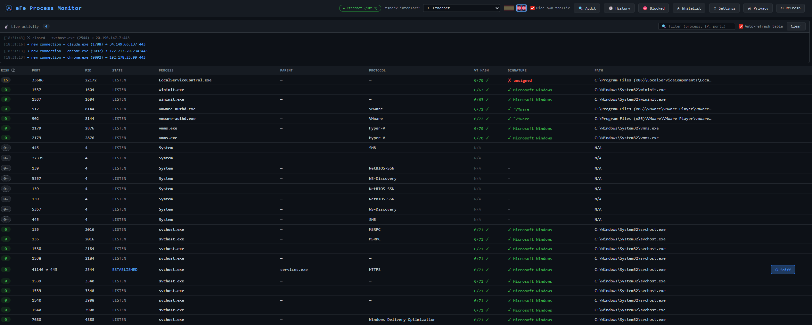
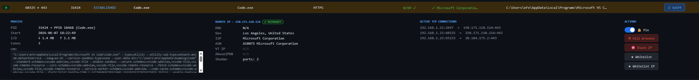
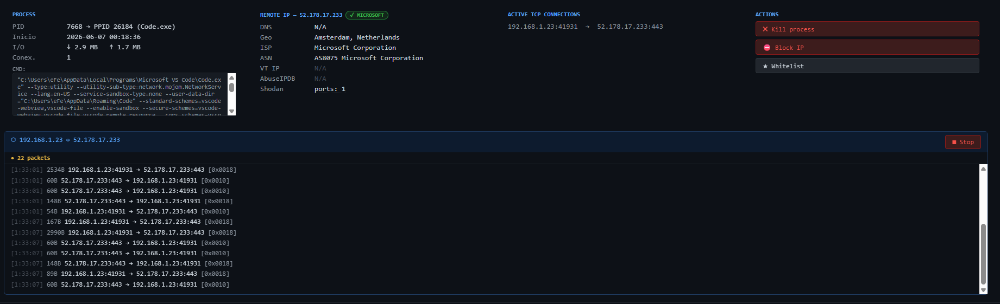
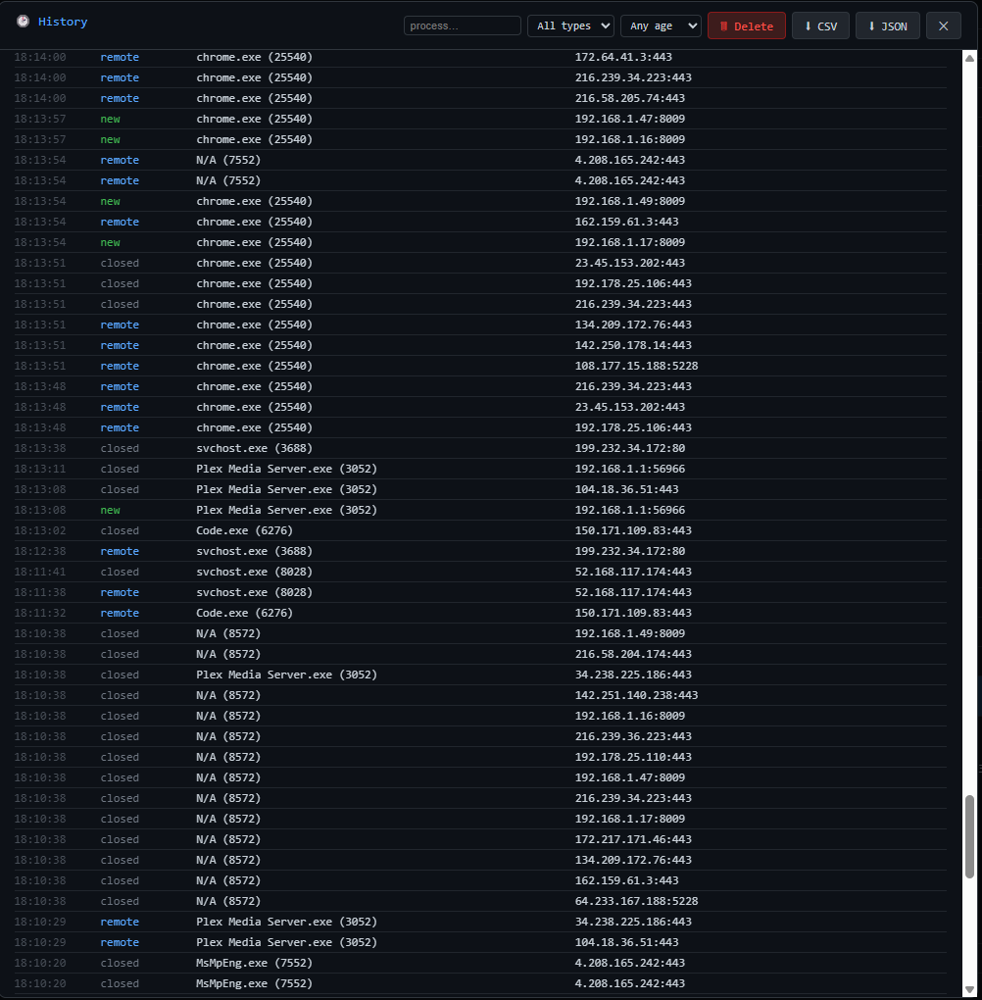

<div align="center">


# eFe Process Monitor

Monitor de procesos y red con un panel web local. Muestra a qué proceso pertenece
cada conexión, a dónde se conecta y qué dicen las fuentes de reputación/inteligencia
sobre el binario y la IP remota.


[English](README.md) · **Español**

</div>

> **Estado: estable.** Funciona y se usa a diario. La interfaz y los datos guardados pueden evolucionar entre versiones.

<div align="center">

</div>

## Qué es

Un único binario autocontenido (sin instalación, sin dependencias, sin cgo) que
sirve un panel web en `127.0.0.1:5000`. Lista cada conexión TCP/UDP activa junto
con el proceso que hay detrás, y enriquece cada una con datos de reputación del
binario y de la IP. A grandes rasgos: `netstat`/TCPView, más consultas de
reputación, una captura de paquetes y una auditoría del equipo, en una sola
página local.

Es una herramienta **defensiva / forense** — para inspeccionar tu propia máquina,
no para atacar a otros.

## Características

**Conexiones y procesos**
- Cada conexión TCP/UDP con su proceso: padre, línea de comandos, hora de inicio,
  contadores de E/S y el resto de sockets abiertos del proceso.

**Reputación e inteligencia**
- Binario: hash SHA-256 en **VirusTotal**, y firma de código — **Authenticode** en
  Windows, **pertenencia a paquete** (`dpkg`/`rpm`/`pacman`) en Linux.
- IP remota: geolocalización / ISP / ASN, DNS inverso, **VirusTotal**, **AbuseIPDB**,
  nodos de salida **Tor**, **abuse.ch** (Feodo + ThreatFox), **Spamhaus DROP** y
  **Shodan** (puertos abiertos / CVEs).
- **Score de riesgo (0–100)** que combina todas las señales, ordenable, con el
  desglose por señal al pasar el ratón. Es heurístico: un valor bajo significa
  "sin señales", no "seguro" — las filas con datos incompletos (p. ej. una consulta
  a VirusTotal pendiente) se marcan, y los reportes ruidosos sobre grandes
  proveedores se atenúan para reducir falsas alarmas.

**Monitorización en vivo**
- Feed por SSE de conexiones nuevas/cerradas y procesos nuevos, heurísticas de
  **beaconing/C2** (conexiones regulares al mismo host), anomalías de binario nuevo
  y **notificaciones de escritorio** opcionales.
- **Fija** una conexión para conservar una copia congelada de su tarjeta aunque se
  cierre.

**Captura y auditoría**
- **Captura de paquetes** por conexión con `tshark` (TLS SNI, host HTTP, DNS, flags;
  exportación a pcap), con detección automática de interfaz.
- **Auditoría del equipo**: comprobaciones heurísticas de procesos sospechosos,
  persistencia, hardening e indicios de rootkit (se ejecuta 100% en local — ver
  *Privacidad*).

**Acciones e histórico**
- Matar un proceso, bloquear/desbloquear una IP en el firewall, whitelist de
  binarios o de IPs.
- **Info de host LAN**: NetBIOS / DNS / MAC, con búsqueda offline de **fabricante
  (OUI)**.
- **Histórico** forense en SQLite, exportable a CSV/JSON, con borrado por filtros
  (por proceso, tipo o antigüedad).

**Otros**
- **Login con contraseña** opcional, y exposición a la red por **HTTPS** opcional
  (desactivada por defecto — ver *Acceso*).
- Interfaz bilingüe (inglés / español), icono en la bandeja del sistema en Windows y Linux (escritorios SNI), binario único. macOS sin probar — úsalo bajo tu cuenta y riesgo.

## Capturas

| Detalle de conexión e intel de IP | Captura de paquetes |
|---|---|
|  |  |

| Histórico forense |
|---|
|  |

## Instalación

Descarga el binario para tu SO desde la página de [Releases](../../releases) y ejecútalo.

O compila desde el código (Go 1.26+, sin cgo):

```bash
git clone https://github.com/eFeSpain/efe-process-monitor.git
cd efe-process-monitor
go build -o efemon .                       # Windows: efemon.exe
GOOS=linux  CGO_ENABLED=0 go build -o efemon .   # compilar para Linux
GOOS=darwin CGO_ENABLED=0 go build -o efemon .   # compilar para macOS
```

## Uso

```bash
./efemon          # sirve http://127.0.0.1:5000 y lo abre en el navegador
```

- Ejecútalo como **administrador / root** para ver todos los procesos (nombre, exe,
  firma) y para usar *matar* / *bloquear IP*. Sin elevación también funciona, pero
  algunos procesos salen como `N/A` (te avisa).
- La **captura de paquetes** es opcional y necesita [tshark/Wireshark](https://www.wireshark.org/) en el `PATH`.
- Solo corre **una instancia** a la vez; lanzar una segunda abre el panel existente.
- En **Windows** vive en la **bandeja del sistema** — clic derecho para abrir o
  salir; cerrar la pestaña del navegador no lo detiene.
- En **Linux** también usa la bandeja del sistema en escritorios con soporte SNI
  (KDE, XFCE, MATE, Cinnamon…). En GNOME necesitas la extensión
  [AppIndicator and KStatusNotifierItem Support](https://extensions.gnome.org/extension/615/appindicator-support/);
  sin ella (o en escritorios no compatibles), no aparece icono — en su lugar
  se muestra un botón **Detener** en el panel web.
- **macOS** no ha sido probado nunca — el binario puede compilar y arrancar pero el comportamiento es desconocido. No se ofrece soporte.

### Claves de API (opcional)

Las consultas a VirusTotal y AbuseIPDB necesitan claves gratuitas — añádelas en
**⚙ Ajustes** (se guardan en `.env`) o crea un `.env` junto al binario:

```
VT_API_KEY=tu_clave_de_virustotal
ABUSEIPDB_API_KEY=tu_clave_de_abuseipdb
```

Geolocalización, Tor, Feodo/ThreatFox, Spamhaus y Shodan funcionan **sin clave**.
Sin las de VirusTotal/AbuseIPDB, esas dos simplemente se omiten.

## Acceso

Por defecto el panel escucha **solo en `127.0.0.1`** y **sin contraseña** — expone
datos sensibles y acciones destructivas, así que está pensado como herramienta
local.

- Si quieres exponerlo a la red, **activa primero una contraseña** en Ajustes.
  Exponerlo solo se permite con contraseña, y entonces se sirve por **HTTPS** (se
  genera un certificado autofirmado automáticamente).

## Privacidad

Sin telemetría; todo se guarda en local (`efemon.db`). Para enriquecer la
información, la herramienta consulta servicios externos sobre las IPs/hashes que
**tú inspeccionas**: ip-api, VirusTotal, AbuseIPDB y Shodan reciben esos valores;
las listas de abuse.ch / Spamhaus / Tor son descargas públicas que no revelan nada
de ti. Los resultados se cachean, así que cada binario/IP se consulta como mucho
una vez (cada hora las IPs). La auditoría del equipo corre 100% en local. El panel
**🛰 Privacidad** de la app detalla exactamente qué sale y a dónde.

## Stack

Go · [gopsutil](https://github.com/shirou/gopsutil) · `net/http` + `html/template`
+ `go:embed` · [modernc.org/sqlite](https://modernc.org/sqlite) (sin cgo) ·
[fyne.io/systray](https://github.com/fyne-io/systray) · `tshark` para la captura.

## Licencia

[MIT](LICENSE) © eFe

## Apoyar

Si te resulta útil, puedes apoyar su desarrollo con el botón **💖 Sponsor** de
arriba del repositorio. ¡Gracias!
