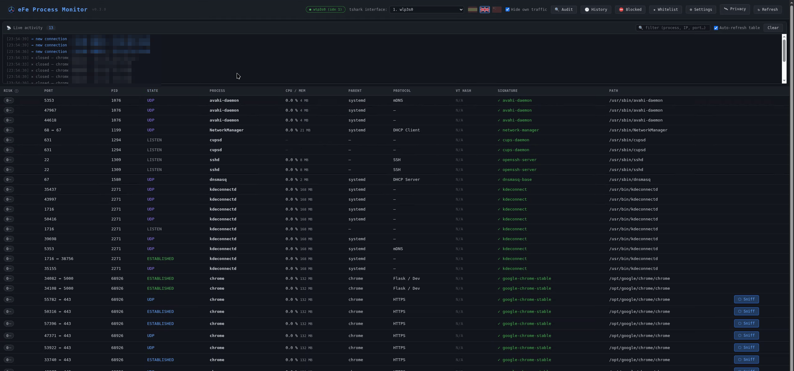
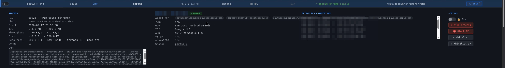
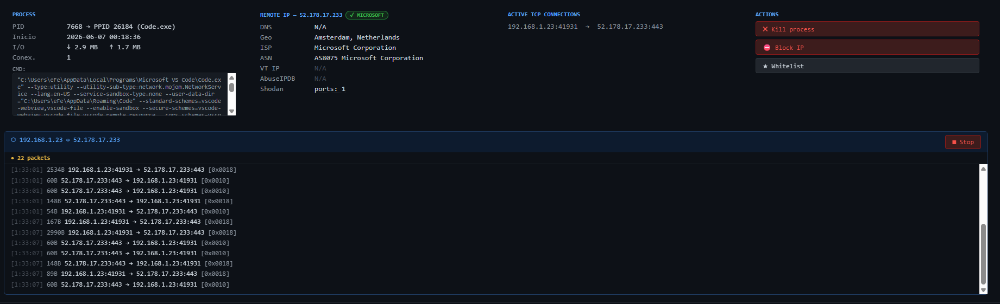
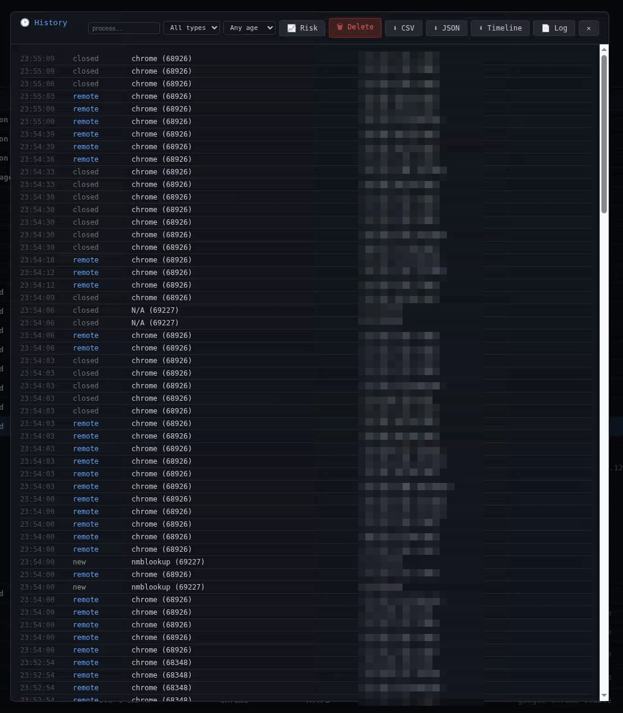

<div align="center">


# eFe Process Monitor

Process and network monitor with a local web dashboard. It shows which process
each connection belongs to, where it connects, and what reputation/threat-intel
sources say about the binary and the remote IP.


**English** · [Español](README.es.md)

</div>

> **Status: stable.** Works and is used day to day. Interfaces and stored data may evolve between versions.

<div align="center">

</div>

## What it is

A single, self-contained binary (no install, no dependencies, cgo-free) that
serves a web dashboard on `127.0.0.1:5000`. It lists every active TCP/UDP
connection together with the process behind it, and enriches each one with
binary and IP reputation data. Roughly: `netstat`/TCPView, plus reputation
lookups, a packet capture and a machine audit, in one local page.

It's a **defensive / forensic** tool — for inspecting your own machine, not for
attacking others.

## Features

**Connections & processes**
- Every TCP/UDP connection with its owning process: parent, command line, start
  time, I/O counters and the process's other open sockets.
- **Full process ancestry** (`powershell.exe ← winword.exe ← explorer.exe`), with
  spawn-chain detection: a document or browser launching a script host, or a web
  server launching a shell, is flagged and scored. That distinction is what
  separates a user opening a terminal from a macro running a payload — the process,
  its path and its signature are identical in both cases.

**Reputation & threat intel**
- Binary: SHA-256 lookup on **VirusTotal**, and code signature — **Authenticode**
  on Windows, **package ownership** (`dpkg`/`rpm`/`pacman`) on Linux.
- **What the process actually asked for**: hostnames observed bound to an address
  during a capture, from the TLS **SNI** (client-declared, the strongest binding
  there is) and from **DNS answer records**. This is a different and better thing
  than reverse DNS, which is what the address *owner* claims — a malicious host
  controls its own PTR record but not what your browser writes into a handshake.
- Remote IP: geolocation / ISP / ASN, reverse DNS, **VirusTotal**, **AbuseIPDB**,
  **Tor** exit nodes, **abuse.ch** (Feodo + ThreatFox), **Spamhaus DROP** and
  **Shodan** (open ports / CVEs).
- **Threat score (0–100)** combining all signals, sortable, with a per-signal
  breakdown on hover. It's a heuristic: a low score means "no signals found",
  not "safe" — rows with incomplete data (e.g. a pending VirusTotal lookup) are
  marked, and noisy reports on big providers are attenuated to cut false alarms.

**Live monitoring**
- SSE feed of new/closed connections and new processes, **beaconing/C2**
  heuristics (regular connections to the same host), new-binary anomalies, and
  optional **desktop notifications**.
- **Pin** a connection to keep a frozen copy of its card even after it closes.

**Capture & audit**
- Per-connection **packet capture** via `tshark` (TLS SNI, HTTP host, DNS, flags;
  pcap export), with automatic interface detection.
- **Machine audit**: heuristic checks for suspicious processes, persistence,
  hardening and rootkit indicators (runs entirely locally — see *Privacy*).

**Actions & history**
- Kill a process, block/unblock an IP at the firewall, whitelist binaries or IPs.
- **LAN host info**: NetBIOS / DNS / MAC, with offline **OUI vendor** lookup.
- Forensic **history** in SQLite, exportable to CSV/JSON, with filtered deletion
  (by process, type or age).
- **Risk timeline**: one entry each time the verdict for a (binary, remote IP) pair
  changes, with the reasoning that produced it — so "what did this look like on
  Tuesday" has an answer, instead of the score existing only on the rendered page.
- **Application log** (`efemon.log`, rotated at 5 MiB): every operator action
  (kill, block, unblock, settings, history cleared) and every rejected access,
  readable from the dashboard. The release build has no console, so this file is
  the only place that record exists.

**Other**
- Optional **password login**, and optional network exposure over **HTTPS** (off
  by default — see *Access*).
- Bilingual UI (English / Spanish), system-tray icon on Windows and Linux (SNI desktops), single binary.

## Screenshots

| Connection details & IP intel | Packet capture |
|---|---|
|  |  |

| Forensic history |
|---|
|  |

## Install

Download the binary for your OS from the [Releases](../../releases) page and run it.

Or build from source (Go 1.26+, no cgo):

```bash
git clone https://github.com/eFeSpain/efe-process-monitor.git
cd efe-process-monitor
go build -o efemon .                       # Windows: efemon.exe
GOOS=linux  CGO_ENABLED=0 go build -o efemon .   # cross-compile for Linux
GOOS=darwin CGO_ENABLED=0 go build -o efemon .   # cross-compile for macOS
```

## Usage

```bash
./efemon          # serves http://127.0.0.1:5000 and opens it in your browser
```

- Run as **administrator / root** to see every process (name, exe, signature) and
  to use *kill* / *block IP*. Without elevation it still runs, but some processes
  show `N/A` (it warns you).
- **Packet capture** is optional and needs [tshark/Wireshark](https://www.wireshark.org/) on `PATH`.
- Only **one instance** runs at a time; launching a second just opens the dashboard.
- On **Windows** it lives in the **system tray** — right-click to open or quit;
  closing the browser tab does not stop it.
- On **Linux** it also uses the system tray on SNI-compatible desktops (KDE,
  XFCE, MATE, Cinnamon…). On GNOME you need the
  [AppIndicator and KStatusNotifierItem Support](https://extensions.gnome.org/extension/615/appindicator-support/)
  extension; without it (or on any other unsupported desktop), no tray icon
  appears — a **Stop** button is shown in the web dashboard instead.
- **macOS is not supported and no macOS binary is published.** The code still
  cross-compiles for darwin and CI keeps proving it, so you can build from source
  — but be aware of *why* it isn't shipped: several audit probes have no macOS
  implementation (the process cross-view and the deleted-binary check), so the
  audit would be reporting on checks it cannot actually run. It now says
  "not available on this OS" instead of passing them, which is honest but still
  means you'd be using a security tool with holes in it. Untested and unsupported.

### API keys (optional)

VirusTotal and AbuseIPDB lookups need free API keys — add them in **⚙ Settings**
(saved to `.env`) or create a `.env` next to the binary:

```
VT_API_KEY=your_virustotal_key
ABUSEIPDB_API_KEY=your_abuseipdb_key
```

Geolocation, Tor, Feodo/ThreatFox, Spamhaus and Shodan work with **no key**.
Without VirusTotal/AbuseIPDB keys, those two are simply skipped.

## Access

By default the dashboard binds to **`127.0.0.1` only**. There is always exactly
one gate in force:

- **No password (default): a local access token.** Binding to loopback stops
  remote machines, but not other programs on *this* one — and the tool is meant
  to run elevated, so an unprivileged process reaching the port would inherit
  kill / firewall / settings. At startup a random token is written to
  `efemon-token` (mode 0600) next to the binary and passed to the browser in the
  URL the app opens; the browser trades it for a session cookie and keeps working
  from that. Always open the panel from the **tray icon** or by launching the
  binary again — a bookmark hit from a cold browser shows a page telling you so.
  On Unix a root-owned token file keeps non-elevated processes out; on Windows a
  same-user process may still read it, so there it raises the bar rather than
  closing the door.
- **A password, if you set one** in Settings. It replaces the token gate.
  Changing or removing it requires the current password.

Binding to the network is only allowed with a password set, and is then served
over **HTTPS** (a self-signed certificate is generated automatically).

Requests are also checked for a loopback/IP-literal `Host` (anti DNS-rebinding)
and a same-origin `Origin` on every state-changing request (anti CSRF).

## Privacy

No telemetry; everything is stored locally (`efemon.db`). To enrich data the tool
queries external services for the IPs/hashes **you inspect**: ipwho.is, VirusTotal,
AbuseIPDB and Shodan receive those values; the abuse.ch / Spamhaus / Tor lists are
plain public downloads that reveal nothing about you. Results are cached so each
binary/IP is queried at most once (hourly for IPs). The machine audit runs fully
locally. The in-app **🛰 Privacy** panel spells out exactly what goes where.

## Tech stack

Go · [gopsutil](https://github.com/shirou/gopsutil) · `net/http` + `html/template`
+ `go:embed` · [modernc.org/sqlite](https://modernc.org/sqlite) (cgo-free) ·
[fyne.io/systray](https://github.com/fyne-io/systray) · `tshark` for capture.

## License

[MIT](LICENSE) © eFe

## Support

If you find it useful, you can support its development with the **💖 Sponsor**
button at the top of the repository. Thanks!
